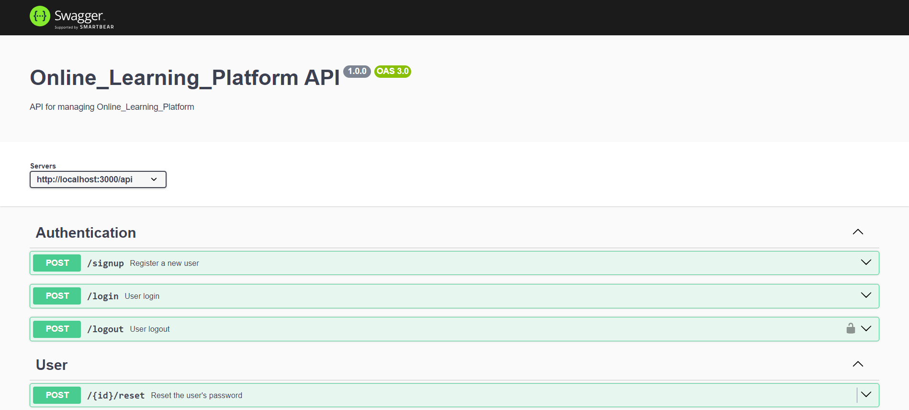
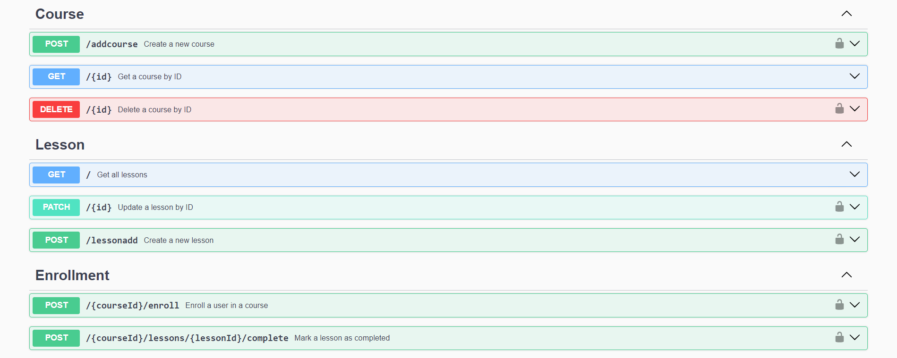

# Course Management System Backend

This is a backend system for managing courses, user enrollment, and progress tracking. The system is built using Express.js and MongoDB, with JWT authentication for secure access. It supports user authentication, course management, user enrollment, and lesson completion tracking.

## Table of Contents
- [Features](#features)
- [Requirements](#requirements)
- [Technologies Used](#technologies-used)
- [Installation](#installation)
- [Usage](#usage)
- [API Endpoints](#api-endpoints)
- [Database Models](#database-models)
- [Security](#security)
- [API Documentation](#api-documentation)
- [Contributing](#contributing)
- [License](#license)

## Features
1. **User Authentication**:
   - User registration, login, and password reset functionalities using JWT for authentication.
   - Role-based access control for different features (Admin and User roles).

2. **Course Management**:
   - CRUD operations for courses (only accessible by admin users).
   - Each course can have multiple lessons associated with it.

3. **User Enrollment**:
   - Users can enroll in courses.
   - Tracking of enrollment date and course progress.

4. **Lesson Completion Tracking**:
   - Track the completion status of lessons for each enrolled user.

5. **Security**:
   - JWT-based authentication for secure access.
   - Protected endpoints for course content and administrative functions.

## Technology Stack
- **Backend**: Node.js, Express.js
- **Database**: MongoDB with Mongoose
- **Authentication**: JWT (JSON Web Token)
- **Other Libraries**: bcrypt for password hashing, Swagger for API documentation

## Installation

### Prerequisites
- Node.js (version 14 or higher)
- MongoDB (running locally or hosted)
- npm (Node Package Manager)

 ## Online_Lerning Swagger UI
   
   
   <br>

   

## Technologies Used
- Node.js
- Express.js
- MongoDB
- JWT (JSON Web Token)


### Setup .env file

```bash
DATABASE_URL=Your_mongo_url
PORT=Sevice_port
NODE_ENV=NODE_ENVIRINMENT
JWT_SECRET=jwt_secret
```

### Run this app locally

```shell
npm run build
```

### Start the app

```shell
npm start
```
